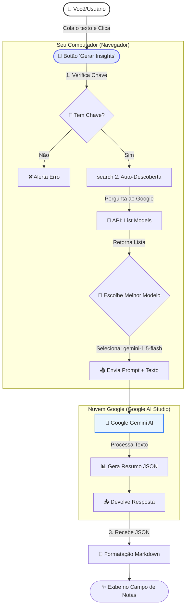

# 🧠 Como Funciona o Assistente de IA & Custos

Este documento explica o fluxo técnico do botão que criamos e detalha a estrutura de custos da API do Google Gemini.

## 🗺️ Mapa Mental: O Caminho do Clique 

---

## 💰 Análise de Custos: "Vou pagar por isso?"

**Resumo Curto:** Não. Para o seu uso atual, é **100% Gratuito**.

Você está utilizando a **API Gemini via Google AI Studio** no plano **Gratuito (Free Tier)**.

### O que o plano Gratuito oferece?
A Google é extremamente generosa neste plano para desenvolvedores e pequenas aplicações.

| Recurso | Limite Gratuito | O que significa na prática? |
| :--- | :--- | :--- |
| **Requisições por Minuto (RPM)** | **15 RPM** | Você pode clicar no botão 15 vezes **A CADA MINUTO** sem parar. |
| **Requisições por Dia (RPD)** | **1.500 RPD** | Você pode analisar 1.500 conversas por dia. |
| **Tokens por Minuto (TPM)** | **1 Milhão de Tokens** | Equivalente a colar livros inteiros de texto a cada minuto. |

*Nota: Os limites podem variar levemente dependendo do modelo exato (Flash vs Pro), mas sempre ficam nessa faixa generosa.*

### Existe risco de cobrança surpresa?
**NÃO.**
1.  O "Plano Pago" (Pay-as-you-go) só é ativado se você **explicitamente** vincular uma conta de faturamento (cartão de crédito) no Google Cloud Console a este projeto.
2.  Se você apenas criou a chave no Google AI Studio sem configurar pagamentos, quando o limite for atingido, a API simplesmente para de responder temporariamente (Erro 429) e volta no próximo minuto/dia. **Ela não cobra automaticamente.**

### "Posso usar à vontade?"
**SIM.**
Como um usuário individual ou pequena equipe usando o CRM:
- É humanamente impossível você estourar o limite de 15 requisições por minuto operando o CRM manualmente.
- Você teria que clicar no botão a cada 4 segundos, sem parar, para ser bloqueado.

---

## 🔒 Privacidade (O único "preço")

No plano **Gratuito**, a Google se reserva o direito de usar os dados enviados (o texto das conversas) para treinar e melhorar os modelos deles, embora os dados sejam anonimizados.
- **Para dados ultraconfidenciais:** Recomenda-se o plano pago (Enterprise), onde a Google garante que dados não treinam a IA.
- **Para dados comerciais comuns:** O plano gratuito é padrão de mercado.

## 🎯 Conclusão
- **Custo Financeiro:** R$ 0,00.
- **Limite de Uso:** Virtualmente ilimitado para uso manual.
- **Manutenção:** Zero. O código de "Auto-Descoberta" que implementamos garante que se a Google mudar o nome do modelo (ex: de `1.5` para `2.0`), o botão continua funcionando sem você precisar me chamar.
